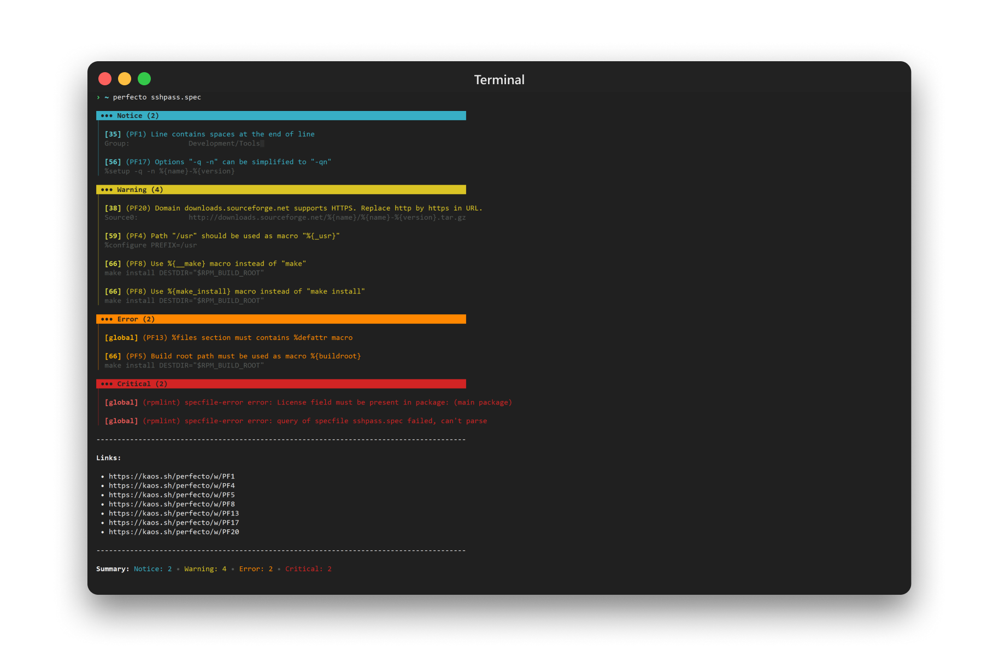
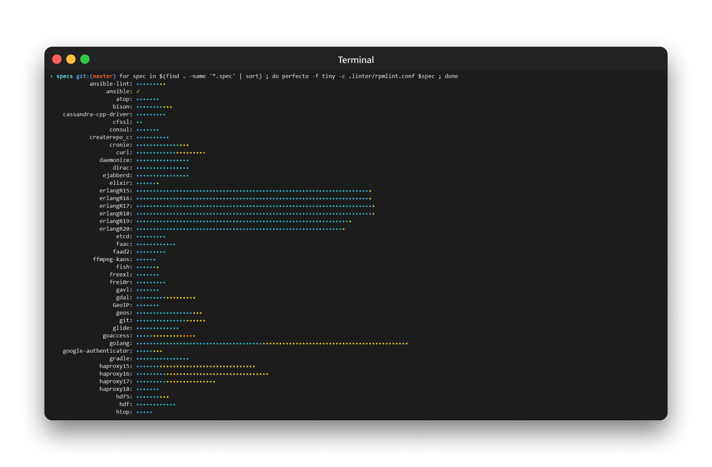

<p align="center"><a href="#readme"></a></p>

<p align="center">
  <a href="https://kaos.sh/r/perfecto"></a>
  <a href="https://kaos.sh/l/perfecto"></a>
  <a href="https://kaos.sh/y/perfecto"></a>
  <br/>
  <a href="https://kaos.sh/c/perfecto"></a>
  <a href="https://kaos.sh/w/perfecto/ci-push"></a>
  <a href="https://kaos.sh/w/perfecto/codeql"></a>
  <a href="#license"></a>
</p>

<p align="center"><a href="#checks">Checks</a> • <a href="#installing">Installing</a> • <a href="#usage">Usage</a> • <a href="#ci-status">CI Status</a> • <a href="#license">License</a></p>

<br/>

_perfecto_ is tool for checking perfectly written RPM specs. Currently, _perfecto_ used by default for checking specs for [EK Public Repository](https://kaos.sh/kaos-repo).





### Checks

You can find additional information about every _perfecto_ check in [project wiki](https://github.com/essentialkaos/perfecto/wiki).

### Installing

#### From sources

Make sure you have a working Go 1.22+ workspace ([instructions](https://go.dev/doc/install)), then:

```bash
go install github.com/essentialkaos/perfecto@latest
```

#### From [ESSENTIAL KAOS Public Repository](https://kaos.sh/kaos-repo)

```bash
sudo dnf install -y https://pkgs.kaos.st/kaos-repo-latest.el$(grep 'CPE_NAME' /etc/os-release | tr -d '"' | cut -d':' -f5).noarch.rpm

# EL8 (OracleLinux/Alma/Rocky 8)
sudo dnf install perfecto

# Alma/Rocky 9
sudo dnf --enablerepo=crb install perfecto
# OracleLinux 9
sudo dnf --enablerepo=ol9_codeready_builder install perfecto
```

#### Prebuilt binaries

You can download prebuilt binaries for Linux and macOS from [EK Apps Repository](https://apps.kaos.st/perfecto/latest):

```bash
bash <(curl -fsSL https://apps.kaos.st/get) perfecto
```

#### Container image

Official _perfecto_ images available on [GitHub Container Registry](https://kaos.sh/p/perfecto) and [Docker Hub](https://kaos.sh/d/perfecto). Install the latest version of [Podman](https://podman.io/getting-started/installation.html) or [Docker](https://docs.docker.com/engine/install/), then:

```bash
curl -#L -o perfecto-container https://kaos.sh/perfecto/perfecto-container
chmod +x perfecto-container
sudo mv perfecto-container /usr/bin/perfecto
perfecto your.spec
```

Official container images with _perfecto_:

- [`ghcr.io/essentialkaos/perfecto:micro`](https://kaos.sh/p/perfecto) (_without_ `rpmlint`)
- [`ghcr.io/essentialkaos/perfecto:ol8`](https://kaos.sh/p/perfecto) (_with_ `rpmlint`)
- [`ghcr.io/essentialkaos/perfecto:ol9`](https://kaos.sh/p/perfecto) (_with_ `rpmlint`)
- [`essentialkaos/perfecto:micro`](https://kaos.sh/d/perfecto) (_without_ `rpmlint`)
- [`essentialkaos/perfecto:ol8`](https://kaos.sh/d/perfecto) (_with_ `rpmlint`)
- [`essentialkaos/perfecto:ol9`](https://kaos.sh/d/perfecto) (_with_ `rpmlint`)

#### Using with Github Actions

For using latest stable version _perfecto_ with Github Actions use this `perfecto.yml` file or add it to your workflow:

```yaml
name: Perfecto

on:
  push:
    branches: [master, develop]
  pull_request:
    branches: [master]

jobs:
  Perfecto:
    name: Perfecto
    runs-on: ubuntu-latest

    steps:
      - name: Code checkout
        uses: actions/checkout@v3

      - name: Login to DockerHub
        uses: docker/login-action@v2
        with:
          registry: ghcr.io
          username: ${{ github.actor }}
          password: ${{ secrets.GITHUB_TOKEN }}

      - name: Check specs with Perfecto
        uses: essentialkaos/perfecto-action@v1
        with:
          files: myapp.spec
```

Additional information about action configuration can be found on [the official GitHub action page](https://github.com/marketplace/actions/ek-perfecto).

### Usage

<p align="center"></p>

### CI Status

| Branch | Status |
|--------|--------|
| `master` | [](https://kaos.sh/w/perfecto/ci-push?query=branch:master) |
| `develop` | [](https://kaos.sh/w/perfecto/ci-push?query=branch:develop) |

### License

[Apache License, Version 2.0](https://www.apache.org/licenses/LICENSE-2.0)

<p align="center"><a href="https://essentialkaos.com"></a></p>
